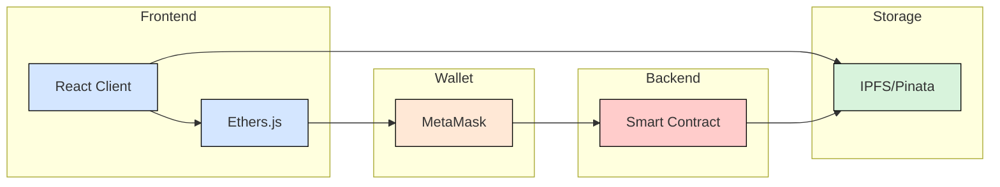
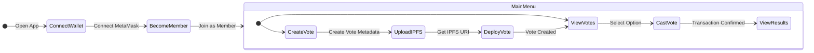

# Decentralized Voting System

A blockchain-based voting system built with Solidity and React that enables users to create and participate in decentralized voting polls. This project demonstrates the integration of smart contracts with a modern web frontend using Ethereum and IPFS.

## Architecture



The system consists of three main components:

- Frontend: React application with Ethers.js for blockchain interaction
- Backend: Solidity smart contract deployed on Ethereum
- Storage: IPFS for storing vote metadata

## Features

- Create voting polls with 2-8 options
- Secure voting through blockchain transactions
- Vote metadata stored on IPFS
- Real-time vote tracking and results
- Time-limited voting periods
- MetaMask integration for secure transactions

## Prerequisites

- Node.js (v14 or higher)
- MetaMask browser extension
- An IPFS service account (e.g., Pinata)

## Installation

### Smart Contract Deployment

1. Navigate to the backend directory:

```bash
cd backend
npm install
```

2. Deploy the contract:

```bash
npx hardhat run scripts/deploy.js
```

3. Copy the deployed contract address for frontend configuration

### Frontend Setup

1. Navigate to the frontend directory:

```bash
cd frontend
npm install
```

2. Configure the contract address and IPFS gateway:

   - Update the contract address in `src/contract.js`
   - Configure the IPFS gateway URL in `src/Votes.js`

3. Start the development server:

```bash
npm start
```

## Usage

### Creating a Vote

1. Connect your MetaMask wallet
2. Become a member by clicking "Become Member"
3. Navigate to "Create Vote"
4. Prepare your vote metadata JSON file and upload to IPFS. Example format:

```json
{
  "description": "What is the best programming language?",
  "options": ["JavaScript", "Java", "C++", "C"]
}
```

5. Enter the IPFS URI, number of options (2-8), and end date
6. Submit the transaction through MetaMask

### Participating in Votes

1. Navigate to "Votes" to see all active polls
2. Connect your wallet if not already connected
3. Click "Vote" next to your chosen option
4. Confirm the transaction in MetaMask

## User Flow



## Configuration

### Network Configuration

The smart contract can be deployed to any EVM-compatible network. Update the network configuration in the frontend by modifying the network ID in your MetaMask connection.

### IPFS Configuration

Configure your preferred IPFS gateway by updating the `gateway` variable in `Votes.js`:

```javascript
const gateway = "YOUR_PREFERRED_IPFS_GATEWAY";
```

## Technical Details

### Smart Contract

- Written in Solidity 0.8.27
- Vote options: minimum 2, maximum 8
- End time functionality to limit voting period
- Member-only voting and creation

### Frontend

- React 18.3.1
- ethers.js 5.7.2
- React Bootstrap for UI components
- React Router for navigation

## License

This project is unlicensed.

## Contributing

Feel free to submit issues and enhancement requests.
